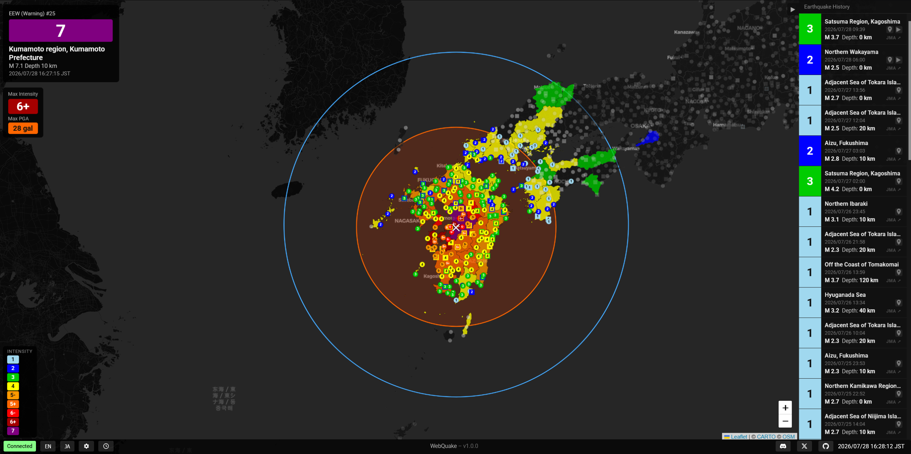

# WebQuake
A web application which uses live earthquake reports and live tsunami information to mitigate the short-term effects of an earthquake in Japan.

You can access WebQuake at https://webqua.ke.


> Japanese is also available by navigating to `/ja` or clicking JA

Japan has thousands of seismological observation stations embedded in land & sea all over. When an earthquake occurs in/near Japan, these stations pick up seismic waves and when 2 or more of them observe abnormalities, the Japan Meteorological Agency (JMA) analyses and predicts an approximate location for the earthquake's intensity and epicenter. If the estimated intensity (over land) is severe enough, an emergency alert is sent to all people in the area to warn them of strong shaking.
If the earthquake occurred over sea (and it was strong enough, among other factors), the JMA further analyses the earthquake to determine if a tsunami is possible, and releases tsunami warnings as appropriate. WebQuake aims to collate this information into one map interface, for easy information access in an emergency, available in both English and Japanese. It also uses notifications to deliver earthquake and tsunami warnings - when WebQuake isn't open.

How to run:
1. Ensure Python is installed. WebQuake requires 3.11 or newer. When python is installed, use pip to install the requirements in `private/requirements.txt`.
2. Go to [DM-DSS](https://dmdata.jp) and subscribe to a plan which gives you the 9 telegrams that WebQuake requires (VXSE43,45,47,51,52,53 AND VTSE41,51,52). The cheapest combination of plans that cover this are 緊急地震（予報）, 緊急地震（警報）, 地震・津波関連 (Emergency earthquake (forecast), Emergency earthquake (alarm) and Earthquakes and Tsunamis) - for a cost of 120JPY/day.
3. In DMDATA's manager, create an OAuth2 application - requesting every scope the connection uses (contract.list, telegram.list, telegram.data socket.start, socket.list, socket.close, telegram.get.earthquake, gd.earthquake, eew.get.forecast, eew.get.warning, gd.eew). This will give you a client ID and client secret. Keep these somewhere safe.
4. Obtain a refresh token. Ensure you have the repo downloaded and open a terminal in the `private` folder. Then run:
``` 
    export WEBQUAKE_DMDATA_CLIENT_ID=your-client-id
    export WEBQUAKE_DMDATA_CLIENT_SECRET=your-client-secret
    python get_refresh.py
```
5. Set the environment by copying .env.example and filling it in. Only 4 variables are required for WebQuake to start, but filling in the optional ones is highly recommended.
6. Run `main.py`. On first start, it'll create everything it needs to run (DB and folders). It binds to port 8000, so open it with http://localhost:8000
7. Replace remaining upstream values, in `index.html` replace `OS_APP_ID` with your OneSignal app ID, and in `app.js` the NTFY variables must match the backend variables in your environment. This does not require a restart.
8. Wire up notifications through OneSignal, ntfy and Discord:
OneSignal:
Create an app, then set the app ID in both the environment and index.html, and the REST API key in the environment only. The bundled service worker files are OneSignal's own one-line boilerplate and need no changes.
ntfy — self-hosted push:
Requires your own ntfy server. Create a publish-only access token for the backend, and choose your own topic names. Topics are public-read by anyone who knows the name, so pick names that aren't guessable if that matters to you.
Discord:
One webhook per language. The bot token is only needed if your channels are announcement channels and you want following servers to receive the messages — it crossposts, nothing more.
9. If you would like to use the admin panel, ensure `WEBQUAKE_ADMIN_PASSWORD` is set and travel to /admin in your browser. Failed logins are throttled per IP at five attempts, then a fifteen-minute lockout. The panel gives access to recorded telegrams and to firing test notifications at your subscribers.
10. Ensure you have read and meet the license terms. WebQuake is AGPL-3.0, so you must keep the source link visible. By default, this is visible through the GitHub button in the bottom bar. Data files listed in NOTICE carry their own terms.

Claude by Anthropic was used to aid development of WebQuake, especially with commenting and scouring the Internet to find crucial information needed for WebQuake. If you prefer to use projects which have not used AI, you can go to https://github.com/lukemattle/webquake-old. However, there is no publicly running instance of this and it does not include a map interface.